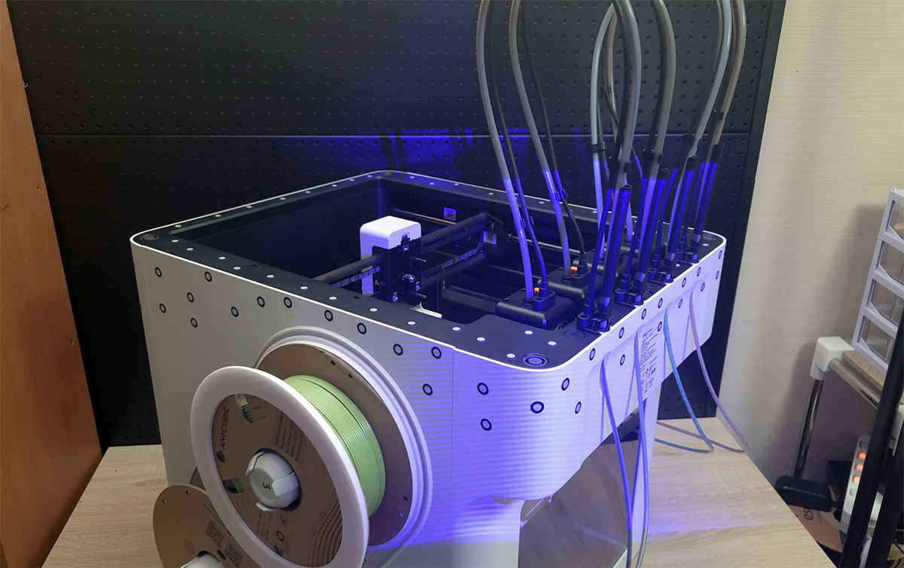
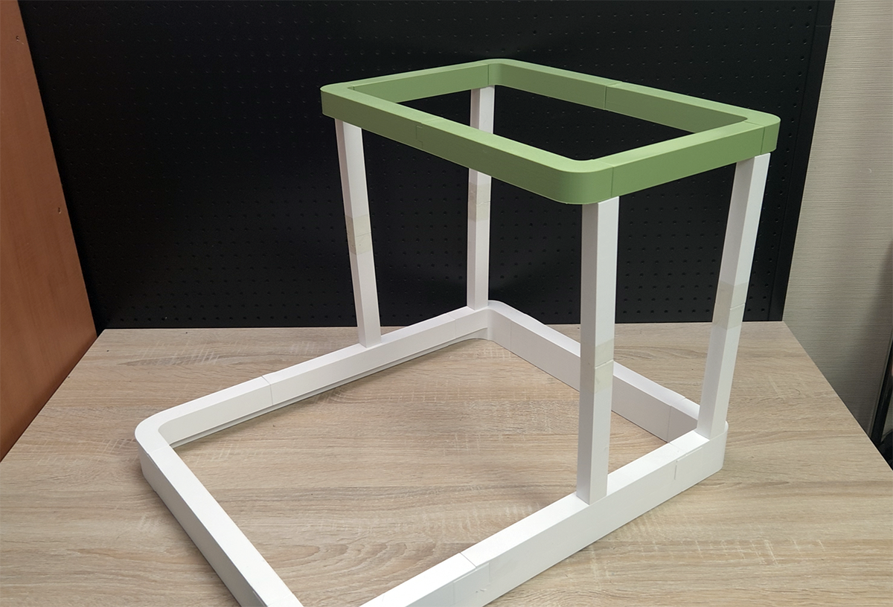
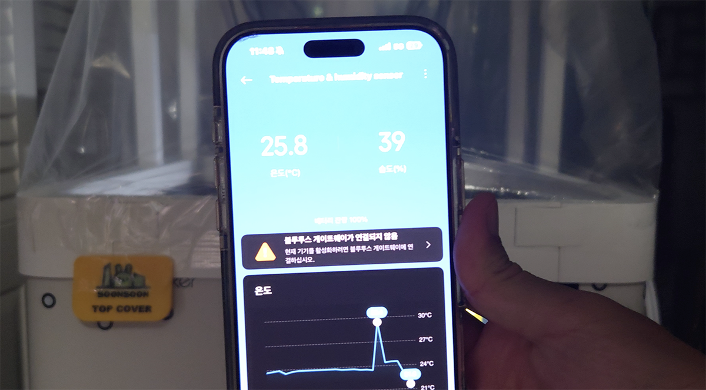
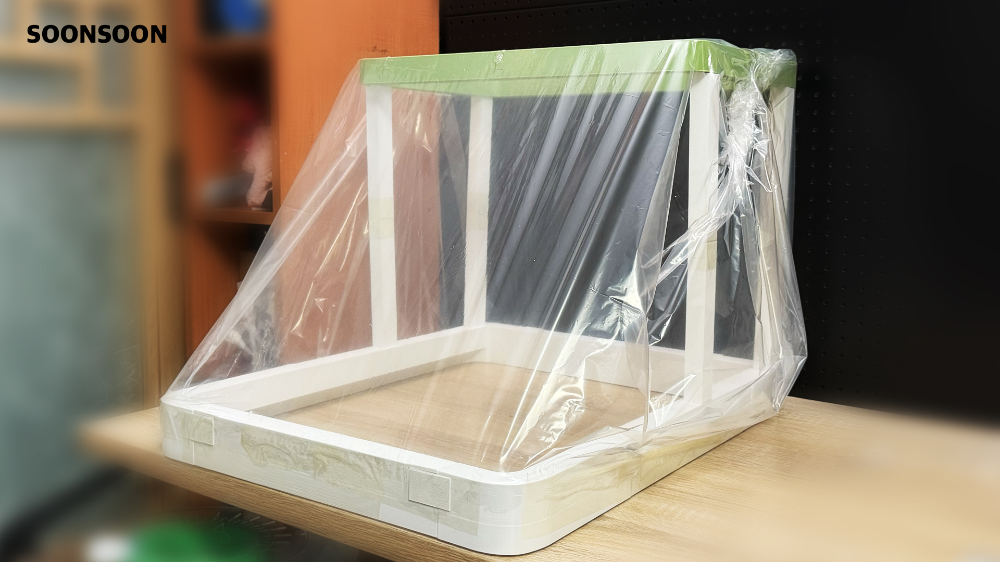

# Snapmaker U1 DIY Top Cover

*Read this in other languages: [English](README.md), [한국어](README_KR.md)*

DIY top cover project for Snapmaker U1 3D printer.

## 📋 Project Overview

This project shares design and printable data for Snapmaker U1 top cover based on 3D scanner measurements.

## 📸 Project Gallery

### 3D Scanning Process

*3D scanning the Snapmaker U1 with Revopoint MetroX*

### Frame Assembly & Testing
<table>
  <tr>
    <td></td>
    <td></td>
  </tr>
  <tr>
    <td><em>Frame assembly test</em></td>
    <td><em>Installed on Snapmaker U1</em></td>
  </tr>
</table>

### Performance Test Results
<table>
  <tr>
    <td></td>
    <td></td>
  </tr>
  <tr>
    <td><em>Cold weather test (10°C ambient temperature)</em></td>
    <td><em>Chamber temperature reached 26°C</em></td>
  </tr>
</table>

*SoonSoon Frame Version 1 - Ready to use with plastic sheeting*

## 📁 Folder Structure

### SizeData
- Design reference data based on 3D scan measurements
- Base data for users to create their own custom covers
- Included files:
  - `U1_Body.stl` - U1 body scan data
  - `BaseGuide.stl` - Base guide reference
  - `SizeDataTopview.jpg` - Top view reference image

### SoonsoonFrameVer1
Frame Version 1 designed for use with plastic sheeting cover

**Version 1 Features:**
- **Budget-friendly**: Designed to create a top cover at the lowest possible cost
- **Frame-only design**: Print the frame and attach large plastic sheeting to prevent heat loss
- **Heat retention**: Keeps internal heat from escaping (noise reduction: ❌)
- **⚠️ Temperature Warning**: Do not use in environments above 20°C (68°F) - may damage U1 or reduce print quality

#### BottomGuide
- Bottom guide parts (divided into 8 parts)
- Printable on 300x300mm+ printers

#### TopGuide  
- Top guide parts (divided into 6 parts)
- Some parts can be printed on 270x270mm printers

#### PillarSet
- Pillar set (top/bottom)

## 🛠️ Build Information

- **3D Scanning**: Revopoint MetroX
- **Design Software**: Fusion 360
- **Recommended Print Size**: 300x300mm+ (some parts compatible with 270x270mm)

## 📜 License & Usage Terms

### ✅ Permitted Uses
- Personal hobby use
- Educational purposes
- Free use

### ❌ Prohibited Uses
- Commercial use
- Redistribution

### ⚠️ Special Permission Required
For commercial use or redistribution, prior permission from the creator is required.

## 🔧 How to Use

1. Reference the `SizeData` folder to create your own custom design
2. Or directly print the STL files from `SoonsoonFrameVer1` folder
3. Cover the printed frame with plastic sheeting to use as top cover

## 📺 Related Videos

### Snapmaker U1 Unboxing & Review

### Day 2 Usage & Initial Precautions

## 💖 Support This Project

If this project helped you, consider supporting it:

## 📞 Contact

For commercial use or redistribution inquiries:
- **GitHub**: soonsoon
- **Email**: soonsoon@soonsoons.com
- **Issues**: Feel free to open an issue on this repository

---

**⚡ Disclaimer**: This data is created as a personal project. Users are responsible for all risks associated with its use.